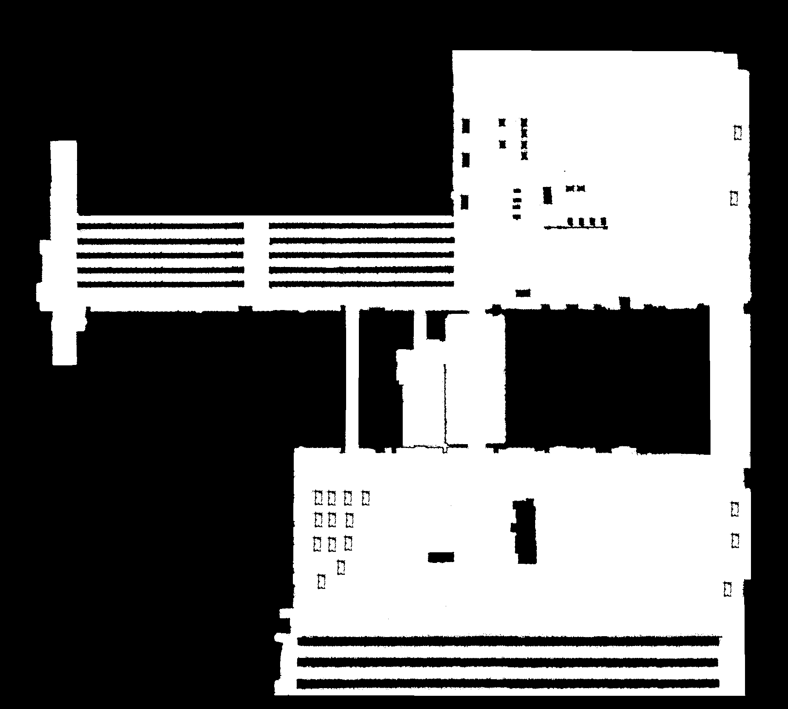
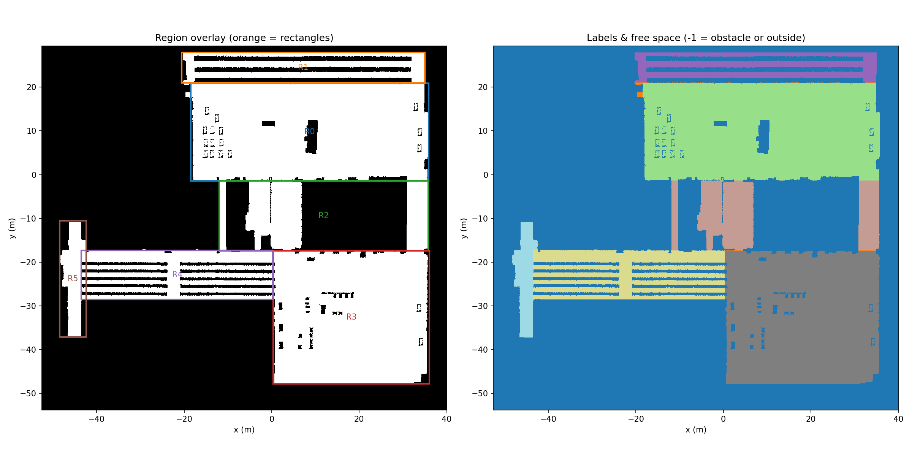
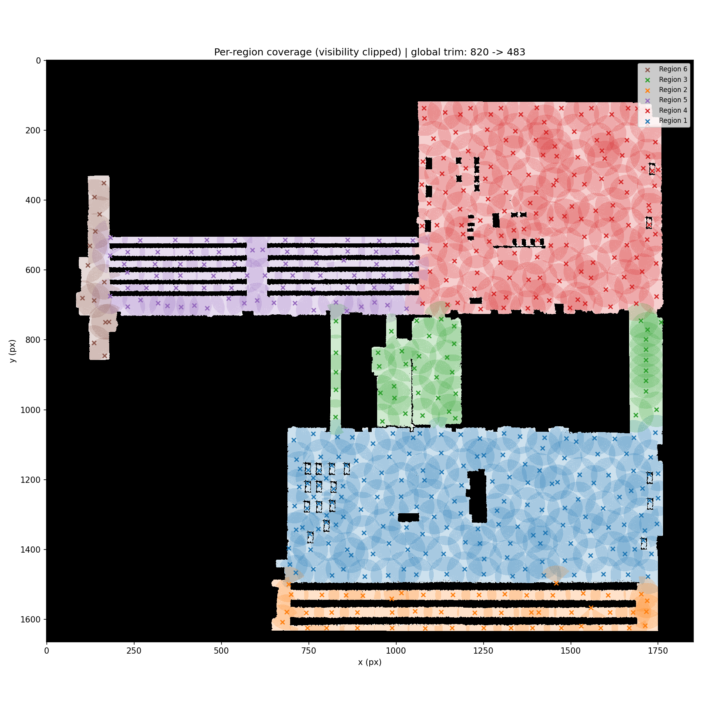

# RBCV 语义探索与加权路径：方法论与学习说明

RBCV（Region-Based Coverage Navigation）意在二维可导航工作空间内完成**系统性覆盖**与**语义加权的闭合巡查**（depot 闭环）：在路程代价与语义收益之间折中，可视作**覆盖路径规划**与**语义主动探索**的耦合——几何层保证可观测覆盖可行，语义层则使全局回路更倾向高价值区，同时对低权区保留**随机探索激励**，缓解过早局部极优。

**栅格占据**将障碍与可通行域离散到统一分辨率的平面上，是可见性判断、候选站位筛选与共用的几何基底；下图示意该占据栅格在平面上的预览效果（灰度/着色对应障碍与自由空间）。路径相对于**本 Markdown 文件**（位于 `src/` 目录）解析；若预览仍为空白，请在资源管理器中确认 **`src/rbcv_disk_coverage/scripts/methodology_map_grid.png`** 等与下文英文名文件存在。

在此基底之上，**长方形分区**把任务域切成与地图坐标系一致的语义矩形单元，便于标注、统计与逐区覆盖；分区与地图**叠图**可直观看清各矩形与可走区域是否对齐、相邻分区如何衔接。

语义对齐常将位姿**投影**至平面 (*x*, *y*)。检测几何上以**等半径圆盘**近似视场、**射线可见性**剔除遮挡；候选站位离散化后借**集合覆盖**的贪心松弛满足覆盖，并可辅以**迭代局部搜索**精炼，所得站位定义调查区 **coverage**：唯有机器人进入约定可达邻域方完成该区观测义务。下图为分区内**圆盘覆盖站位与覆盖效果**的典型输出，对应上述「圆盘 + 可见性 + 覆盖约束」在结果上的直观呈现。

**视觉**与**里程计轨迹**在时间上插值对齐，仅当平面位置落入对应覆盖集时观测才被归因，等价于对似然施加**硬支撑域**，抑制虚假语义。**实例计数**在具备 **track id** 时作轨迹去重，否则用 **DBSCAN** 等密度聚类；计数宜视为**观测支撑强度**而非完备普查，再经钳制与先验 *w*prior、数据项 *w*data 按乘性、加性或取极大等**效用混合**得 *W*(*z*)，即分区上的**离散语义价值场**，亦即**概率语义地图**之可操作近似，非逐格贝叶斯后验。随后对工作区**均匀矩形剖分**得 *W*cell(*i*, *j*)，将分区语义**下采样**至格状态；在四联通格上构建**语义代价地图**：*C*uv = *d*uv · Φ(*W*(*u*), *W*(*v*)), Φ 把高权译为**奖励**（负代价修正），**探索奖金**随机施加于低权格以显式调和**利用—探索**。遍访格心并闭合属 **TSP** 型 **NP-hard** 问题，工程上多用**最近邻**初解 + **2-opt** 局部改进（*O*(*n*²) 量级迭代），起点可偏置**高权格**或**贴边格**以贴近自边界入巡再返。须区分**占据—几何代价地图**（膨胀障碍、动力学可行）与本层的**语义加权偏好场**；语义回路宜作**高层航路点**，再由下层占据敏感规划做**局部可行性与避障**修正，乃**分层规划**常态。信息流为：几何与 coverage → **门控观测** → 计数与 *W*(*z*) → *W*cell → **语义代价地图** → **闭合路径**；亦可在线更新 *W*cell 形成重规划闭环，其骨架仍同上。

（几何示意：与中文文件同目录下另有 `methodology_*.png` 副本，由 `地图栅格预览.png` 等复制生成，便于各编辑器预览。）

